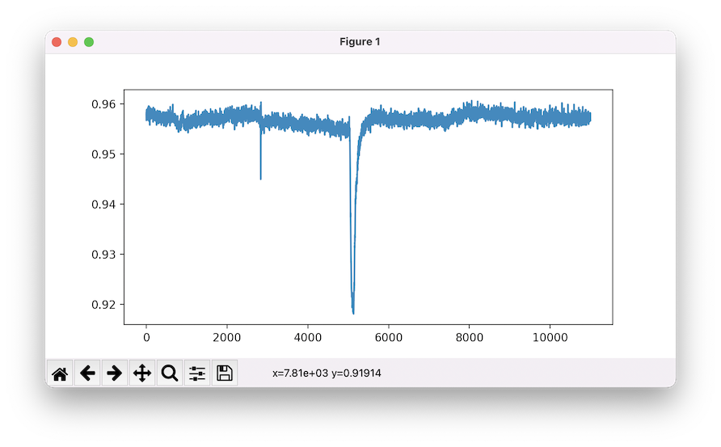

# pyCFS

pyCFS is a pure-Python library for reading CED File System (`.cfs`) files. It is designed to make it easy to extract signal data and metadata from CFS files and convert them to different formats (or analyze them directly in Python).

```python
from pycfs import CFS
import matplotlib.pyplot as pp

dat = CFS("p_001.cfs")
pp.plot(dat.frames[0].data['Force'])
pp.show()

```


This package has been primarily tested with CFS files created by CED Signal 6, but should be compatible with CFS files from other software. If you encounter a file that doesn't work properly, please open an issue!


## Installation

To install the latest development version of pyCFS, run the following command in a terminal window:

```
pip install git+https://github.com/a-hurst/pycfs-signal.git
```


## Compatibility

pyCFS is written based on the PDF documentation for version 2.52 of the CED File System. It has been tested with both single-channel and multi-channel data files recorded by CED Signal 6.03, but has not been tested with data from other versions of Signal (or CFS files from any other software).

Currently pyCFS does not fully support `matrix` or `subsidary` channel types due to a lack of example data.
